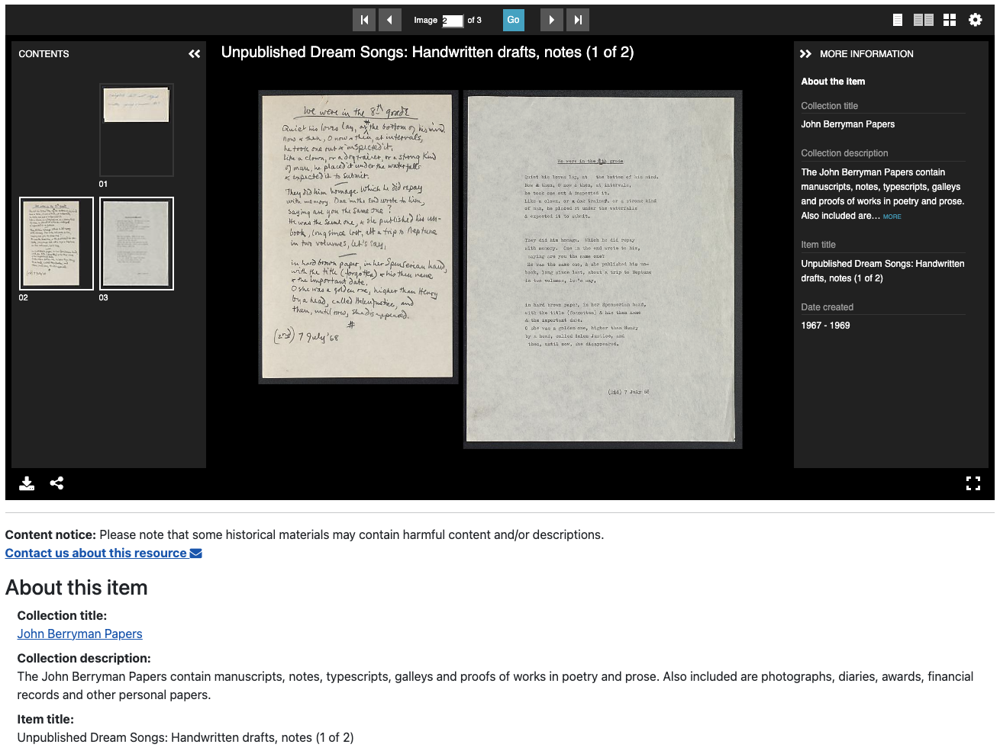

# [Midwest Archives Conference | Des Moines 2024](https://www.midwestarchives.org/2024-mac-annual-meeting)



This is a static page for the illustrative application of IIIF Manifests and Universal Viewer. This is a resource for the talk, [Good Things Come in Threes: Building a Digital Collection at the
University of Minnesota](https://midwestarc.memberclicks.net/assets/documents/MeetingPrograms/MAC_SpringProgram_2024_FINAL.pdf).
<hr>

### FRIDAY, MAY 3 | 11:00 am–12:00 pm | #s402

### Good Things Come in Threes: Building a Digital Collection at the University of Minnesota

One of the many impacts of the COVID-19 pandemic has been an increased focus on digital collections. Join us as we discuss digital collections-development and relationship-building at the University of Minnesota Libraries. How does an increased focus on digital collections encourage us to reevaluate and reprioritize our decision-making in our areas of expertise? What does it mean to work collaboratively to build a digital collection in this new pandemic-driven era? This session will feature presentations from three staff members representing three different departments at UMN Libraries, all of whom are active contributors to the Libraries’ digital collections site, UMedia. First, Head of Digital Library Services, Theresa Berger, will discuss the digitization, metadata, and front-end decision making that goes into creating a digital collection, with an eye on strategies for inclusive metadata and user-informed front-end design. Next, Web Applications Developer, Scott Lawan, will discuss the “back-end,” technical side of things and the importance of sustainable code that can be changed over time and that incorporates web accessibility. Finally, Interim Curator for the Upper Midwest Literary Archives, Erin McBrien, will discuss ways in which low-barrier processing and re-processing decisions can be made to better support digitization and digital collections development. Throughout the presentation, we will highlight ways in which cross-departmental communication and collaboration have contributed to breaking down traditional academic silos and helped promote a more widely accessible digital platform for all.

#### Speakers
- Theresa Berger, University of Minnesota, Head of Digital Library Services (session chair)
- Scott Lawan, University of Minnesota, Libraries Web Applications Developer
- Erin McBrien, Interim Curator - Upper Midwest Literary Archives, University of Minnesota

<hr>

Manifests related to this presentation are as follows
- [Unpublished Dream Songs: Handwritten drafts, notes (1 of 2)](https://sourslaw.github.io/j_berryman_compound/manifests/mac-mockup-compound-dream.json)
- [Correspondence 1947-1949](https://sourslaw.github.io/j_berryman_pound/manifests/mac-mockup-compound-pound.json)

Additional Links
- Link to the demo/example page may be found: [here](https://sourslaw.github.io/mac_hello/)
- Link to the Google Slides: [here](https://docs.google.com/presentation/d/1g1DuYgFLtK3Z34LxC3J5fZnS9lgRrgqeUIXNI9IJHKk/edit?usp=sharing)
- Additional information regarding IIIF may be found: [here](https://iiif.io/)
- Addtional information regarding what the University of Minnesota Libraries is doing with [Blacklight](https://github.com/projectblacklight/blacklight) or IIIF may be directed to: [Lawans@umn.edu](mailto:lawans@umn.edu)

---

This uses UV v3, for v4 examples use https://github.com/UniversalViewer/uv-examples

#### Prerequisites
- [Git](https://git-scm.com/)
- [Node](https://nodejs.org/)

Once these are installed, clone this repository to your file system, then run the following commands in your terminal:

```
cd mac-hello
npm install
npm start
```

Then browse to `localhost:5000`. (You can run the UV on regular port 80, we're just using 5000 to test on localhost).

Video guide: https://youtu.be/wHK5DmMYXZE
